# Architecture Diagrams: Original vs Workflow SDK

Visual representations comparing the two architectural approaches.

---

## 🔄 Execution Flow Comparison

### Original Approach: Synchronous Blocking


---

### Current Approach: Asynchronous Workflow

```mermaid
sequenceDiagram
    participant Client
    participant API as API Route<br/>(app/api/agent/route.ts)
    participant WF as Workflow Orchestrator<br/>(workflows/codeModification.ts)
    participant Steps as Workflow Steps<br/>(workflows/steps.ts)
    participant Sandbox as Vercel Sandbox
    participant GitHub
    participant Dashboard as Vercel Dashboard

    Client->>API: POST /api/agent<br/>{prompt, repoUrl, githubToken}
    activate API
    
    API->>API: Validate inputs
    API->>WF: start(workflow, params)
    activate WF
    
    API-->>Client: 202 Accepted<br/>{runId, message}
    deactivate API
    Note over Client: Client disconnects<br/>✅ Immediate response<br/>✅ Non-blocking
    
    Note over WF,Dashboard: Async execution continues...
    
    WF->>Steps: Step 1: initializeSandbox(repoUrl)
    activate Steps
    Steps->>Sandbox: createSandbox(repoUrl)
    Sandbox-->>Steps: sandbox
    Steps->>Sandbox: git remote -v
    Sandbox-->>Steps: repoInfo
    Steps-->>WF: {repoUrl, repoInfo}
    deactivate Steps
    WF->>Dashboard: Update: Step 1 complete ✓
    
    WF->>Steps: Step 2: analyzeRepository(...)
    activate Steps
    Steps->>Sandbox: createSandbox(repoUrl)
    Steps->>Sandbox: listFiles(".")
    Sandbox-->>Steps: file structure
    Steps->>Steps: determineFilesToModify(prompt)
    Steps-->>WF: {filesToModify, analysis}
    deactivate Steps
    WF->>Dashboard: Update: Step 2 complete ✓
    
    WF->>Steps: Step 3: executeChanges(...)
    activate Steps
    Steps->>Sandbox: createSandbox(repoUrl)
    Steps->>Steps: codingAgent(prompt, repoUrl)
    Note over Steps: AI agent makes changes
    Steps->>Sandbox: git add, commit, checkout
    Steps-->>WF: {changes, branch}
    deactivate Steps
    WF->>Dashboard: Update: Step 3 complete ✓
    
    WF->>Steps: Step 4: createPullRequest(...)
    activate Steps
    Steps->>Sandbox: createSandbox(repoUrl)
    Steps->>GitHub: Push branch & create PR
    GitHub-->>Steps: PR URL & number
    Steps-->>WF: {prUrl, prNumber}
    deactivate Steps
    WF->>Dashboard: Update: Step 4 complete ✓
    
    WF->>Steps: Step 5: notifyUser(...)
    activate Steps
    Steps->>Steps: Send notification email
    Steps-->>WF: {status: "sent"}
    deactivate Steps
    WF->>Dashboard: Update: Step 5 complete ✓
    
    WF->>Dashboard: Workflow complete!<br/>{success, prUrl, changes}
    deactivate WF
    
    Note over Client,Dashboard: ✅ No timeout limits<br/>✅ Automatic retries<br/>✅ State persisted<br/>✅ Full observability
    
    opt Client polls for status
        Client->>API: GET /api/workflow-stream/[runId]
        API-->>Client: Current status & results
    end
```



---

## 🏗️ System Architecture Comparison

### Original: Monolithic Architecture


**Legend:**
- 🔴 Red = Blocking/Synchronous
- 🟡 Yellow = Waiting/Blocked

---

### Current: Microservices-Style Architecture

```mermaid
graph TB
    subgraph "Client Layer"
        Client[Web Browser]
        UI[Progress UI<br/>Real-time Updates]
    end
    
    subgraph "API Layer (Async)"
        APIRoute[API Route<br/>app/api/agent/route.ts]
        StreamAPI[Stream API<br/>GET /workflow-stream/[runId]]
    end
    
    subgraph "Workflow Layer"
        Orchestrator[Workflow Orchestrator<br/>codeModificationWorkflow<br/>'use workflow']
    end
    
    subgraph "Step Layer (Modular)"
        Step1[Step 1<br/>initializeSandbox<br/>'use step']
        Step2[Step 2<br/>analyzeRepository<br/>'use step']
        Step3[Step 3<br/>executeChanges<br/>'use step']
        Step4[Step 4<br/>createPullRequest<br/>'use step']
        Step5[Step 5<br/>notifyUser<br/>'use step']
    end
    
    subgraph "Application Layer"
        Agent[Coding Agent<br/>utils/agent.ts]
        Utils[Sandbox Utils<br/>utils/sandbox.ts]
    end
    
    subgraph "Infrastructure Layer"
        Sandbox[Vercel Sandbox<br/>Per-Step Creation]
        GitHub[GitHub API]
        State[(State Store<br/>Persisted)]
    end
    
    subgraph "Observability Layer"
        Dashboard[Vercel Dashboard<br/>Real-time Monitoring]
        Logs[Structured Logs]
    end
    
    Client -->|POST /api/agent<br/>Immediate 202| APIRoute
    APIRoute -->|start()| Orchestrator
    APIRoute -->|runId| Client
    Client -.->|Poll Status| StreamAPI
    StreamAPI -.->|Status| UI
    
    Orchestrator -->|Sequential| Step1
    Step1 -->|Serialized Data| Step2
    Step2 -->|Serialized Data| Step3
    Step3 -->|Serialized Data| Step4
    Step4 -->|Serialized Data| Step5
    
    Step1 & Step2 & Step3 -->|Uses| Utils
    Step3 -->|Uses| Agent
    Utils -->|Creates| Sandbox
    Step4 -->|Push/PR| GitHub
    
    Step1 & Step2 & Step3 & Step4 & Step5 -->|Save State| State
    Step1 & Step2 & Step3 & Step4 & Step5 -->|Report Progress| Dashboard
    Step1 & Step2 & Step3 & Step4 & Step5 -->|Write| Logs
    
    Dashboard -.->|Monitor| UI
    
    style APIRoute fill:#51cf66
    style Orchestrator fill:#51cf66
    style Step1 fill:#51cf66
    style Step2 fill:#51cf66
    style Step3 fill:#51cf66
    style Step4 fill:#51cf66
    style Step5 fill:#51cf66
    style Client fill:#51cf66
    style Dashboard fill:#339af0
    
    classDef async fill:#51cf66,stroke:#2f9e44,color:#fff
    classDef observability fill:#339af0,stroke:#1971c2,color:#fff
```

**Legend:**
- 🟢 Green = Async/Non-blocking
- 🔵 Blue = Observability/Monitoring

---

## 🔄 State Management Comparison

### Original: No State Persistence

```mermaid
stateDiagram-v2
    [*] --> Request: Client sends request
    Request --> Executing: API calls agent
    
    state Executing {
        [*] --> CreateSandbox
        CreateSandbox --> RunAI
        RunAI --> MakeChanges
        MakeChanges --> CreatePR
        CreatePR --> [*]
    }
    
    Executing --> Success: Completes in <10s
    Executing --> Timeout: Takes >10s
    Executing --> Error: Any failure
    
    Success --> [*]: Return result
    Timeout --> [*]: Lost forever ❌
    Error --> [*]: Lost forever ❌
    
    note right of Timeout
        No state saved
        Must restart from beginning
        All progress lost
    end note
```



---

### Current: Persistent State with Checkpoints

```mermaid
stateDiagram-v2
    [*] --> Request: Client sends request
    Request --> Started: Return runId (202)
    Started --> Step1: Initialize Sandbox
    
    state Step1 {
        [*] --> Init
        Init --> SaveState: ✓ Checkpoint
    }
    
    Step1 --> Step2: Pass serialized data
    
    state Step2 {
        [*] --> Analyze
        Analyze --> SaveState: ✓ Checkpoint
    }
    
    Step2 --> Step3: Pass serialized data
    
    state Step3 {
        [*] --> Execute
        Execute --> SaveState: ✓ Checkpoint
    }
    
    Step3 --> Step4: Pass serialized data
    
    state Step4 {
        [*] --> CreatePR
        CreatePR --> SaveState: ✓ Checkpoint
    }
    
    Step4 --> Step5: Pass serialized data
    
    state Step5 {
        [*] --> Notify
        Notify --> SaveState: ✓ Checkpoint
    }
    
    Step5 --> Complete: Workflow done
    Complete --> [*]
    
    Step1 --> Retry1: Retryable error
    Step2 --> Retry2: Retryable error
    Step3 --> Retry3: Retryable error
    Step4 --> Retry4: Retryable error
    
    Retry1 --> Step1: Exponential backoff
    Retry2 --> Step2: Exponential backoff
    Retry3 --> Step3: Exponential backoff
    Retry4 --> Step4: Exponential backoff
    
    Step1 --> Failed: Fatal error
    Step2 --> Failed: Fatal error
    Step3 --> Failed: Fatal error
    Step4 --> Failed: Fatal error
    Step5 --> Failed: Fatal error
    
    Failed --> [*]
    
    note right of Step1
        State saved after each step
        Can resume from last checkpoint
        Automatic retry with backoff
    end note
```



---

## 📊 Error Handling Comparison

### Original: Single Try-Catch

```mermaid
graph TD
    Start[Request Received] --> Validate{Valid Input?}
    Validate -->|No| Error400[Return 400 Error]
    Validate -->|Yes| Execute[Execute Agent]
    
    Execute --> TryCatch{Try-Catch}
    TryCatch -->|Success| Return200[Return 200 OK]
    TryCatch -->|Any Error| Return500[Return 500 Error]
    
    Return200 --> End[End]
    Return500 --> End
    Error400 --> End
    
    style Return500 fill:#ff6b6b
    style Execute fill:#ff6b6b
    
    note right of TryCatch
        Single attempt
        No retries
        Generic error message
        Lost on failure
    end note
```

---

### Current: Multi-Level Error Handling

```mermaid
graph TD
    Start[Request Received] --> Validate{Validate Input}
    Validate -->|Invalid| CategorizeInput[Categorize Error]
    CategorizeInput --> Return400[Return 400 with Suggestions]
    
    Validate -->|Valid| StartWF[Start Workflow]
    StartWF --> Return202[Return 202 with runId]
    
    Return202 --> Step1[Step 1: Initialize]
    
    Step1 --> Try1{Try-Catch}
    Try1 -->|Success| Save1[Save State]
    Try1 -->|400 Error| Fatal1[FatalError]
    Try1 -->|Other Error| Retry1[RetryableError]
    
    Fatal1 --> Failed[Workflow Failed]
    Retry1 --> Backoff1{Retry Count}
    Backoff1 -->|< Max| Wait1[Exponential Backoff]
    Wait1 --> Step1
    Backoff1 -->|>= Max| Failed
    
    Save1 --> Step2[Step 2: Analyze]
    
    Step2 --> Try2{Try-Catch}
    Try2 -->|Success| Save2[Save State]
    Try2 -->|400 Error| Fatal2[FatalError]
    Try2 -->|Other Error| Retry2[RetryableError]
    
    Fatal2 --> Failed
    Retry2 --> Backoff2{Retry Count}
    Backoff2 -->|< Max| Wait2[Exponential Backoff]
    Wait2 --> Step2
    Backoff2 -->|>= Max| Failed
    
    Save2 --> Step3[Step 3: Execute]
    Step3 --> Try3{Try-Catch}
    Try3 -->|Success| Save3[Save State]
    Try3 -->|Error| RetryLogic3[Retry Logic]
    
    Save3 --> Step4[Step 4: Create PR]
    Step4 --> Try4{Try-Catch}
    Try4 -->|Success| Save4[Save State]
    Try4 -->|Error| RetryLogic4[Retry Logic]
    
    Save4 --> Step5[Step 5: Notify]
    Step5 --> Complete[Workflow Complete]
    
    Failed --> Dashboard1[Report to Dashboard]
    Complete --> Dashboard2[Report to Dashboard]
    
    Dashboard1 --> End[End]
    Dashboard2 --> End
    Return400 --> End
    
    style Complete fill:#51cf66
    style Save1 fill:#51cf66
    style Save2 fill:#51cf66
    style Save3 fill:#51cf66
    style Save4 fill:#51cf66
    style Failed fill:#ff6b6b
    style Fatal1 fill:#ff6b6b
    style Fatal2 fill:#ff6b6b
    
    note right of Retry1
        Automatic retries
        Exponential backoff
        State preserved
        Detailed error messages
        Suggestions provided
    end note
```

---

## 🎯 Data Serialization Pattern

### Original: Object Passing (Not Serializable)

```mermaid
graph LR
    API[API Route] -->|Sandbox Instance| Agent[Coding Agent]
    Agent -->|Sandbox Instance| Tool1[read_file]
    Agent -->|Sandbox Instance| Tool2[list_files]
    Agent -->|Sandbox Instance| Tool3[edit_file]
    Agent -->|Sandbox Instance| Tool4[create_pr]
    
    style API fill:#ff6b6b
    style Agent fill:#ff6b6b
    
    note1[❌ Sandbox instance<br/>not serializable<br/>❌ Lost on timeout<br/>❌ Can't persist]
    Tool1 -.-> note1
```



---

### Current: Serialized Data Passing

```mermaid
graph LR
    API[API Route] -->|runId| Client[Client]
    
    Orchestrator[Workflow] -->|"{repoUrl, repoInfo}"| Step2[Step 2]
    Step2 -->|"{filesToModify, analysis}"| Step3[Step 3]
    Step3 -->|"{changes, branch}"| Step4[Step 4]
    Step4 -->|"{prUrl, prNumber}"| Step5[Step 5]
    
    Step1[Step 1] -->|Creates fresh| Sandbox1[Sandbox]
    Step2 -->|Creates fresh| Sandbox2[Sandbox]
    Step3 -->|Creates fresh| Sandbox3[Sandbox]
    Step4 -->|Creates fresh| Sandbox4[Sandbox]
    
    Orchestrator -->|Serialized Data| Step1
    
    style API fill:#51cf66
    style Orchestrator fill:#51cf66
    style Step1 fill:#51cf66
    style Step2 fill:#51cf66
    style Step3 fill:#51cf66
    style Step4 fill:#51cf66
    style Step5 fill:#51cf66
    
    note1[✅ Only strings/objects<br/>✅ Fully serializable<br/>✅ Persisted to DB<br/>✅ Can resume]
    Step2 -.-> note1
```



---

## 📈 Performance & Reliability Metrics


---

## 🔍 Observability Comparison

### Original: Limited Visibility

```mermaid
graph TD
    Request[Client Request] --> API[API Route]
    API --> Agent[Coding Agent]
    Agent --> Console1[console.log]
    Agent --> Console2[console.error]
    
    Console1 --> Logs[Server Logs]
    Console2 --> Logs
    
    Developer -->|SSH/CLI| Logs
    
    style Logs fill:#ffd93d
    
    note right of Logs
        ❌ No real-time visibility
        ❌ Hard to debug
        ❌ No step breakdown
        ❌ No retry history
    end note
```

---

### Current: Full Observability

```mermaid
graph TD
    Request[Client Request] --> API[API Route]
    API --> Workflow[Workflow Orchestrator]
    
    Workflow --> Step1[Step 1]
    Workflow --> Step2[Step 2]
    Workflow --> Step3[Step 3]
    Workflow --> Step4[Step 4]
    Workflow --> Step5[Step 5]
    
    Step1 --> Dashboard[Vercel Dashboard]
    Step2 --> Dashboard
    Step3 --> Dashboard
    Step4 --> Dashboard
    Step5 --> Dashboard
    
    Step1 --> Logs[Structured Logs]
    Step2 --> Logs
    Step3 --> Logs
    Step4 --> Logs
    Step5 --> Logs
    
    Dashboard --> UI[Real-time UI]
    Dashboard --> API2[Status API]
    
    Developer -->|Web Browser| Dashboard
    Client -->|Poll| API2
    API2 --> UI
    
    style Dashboard fill:#51cf66
    style UI fill:#51cf66
    style Logs fill:#51cf66
    
    note right of Dashboard
        ✅ Real-time progress
        ✅ Step-by-step view
        ✅ Error details
        ✅ Retry history
        ✅ Timing information
        ✅ Final output
    end note
```

---

## 🎓 Summary Diagram


---

## 📚 References

- [ARCHITECTURE_COMPARISON.md](./ARCHITECTURE_COMPARISON.md) - Detailed text comparison
- [WORKFLOW_MIGRATION.md](./WORKFLOW_MIGRATION.md) - Migration guide
- [README.md](./README.md) - Project overview
- [Vercel Workflow SDK](https://vercel.com/docs/workflow) - Official documentation


